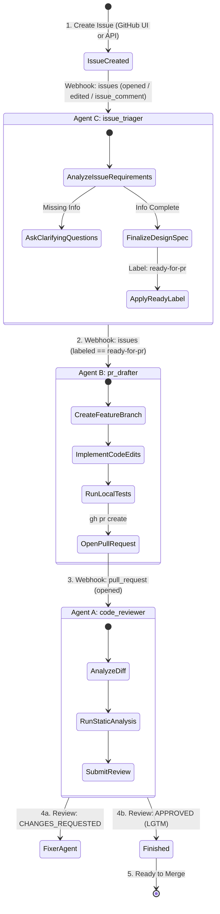
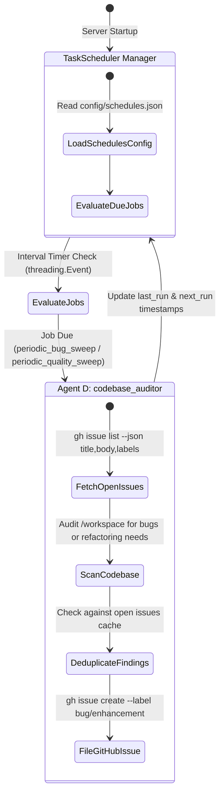
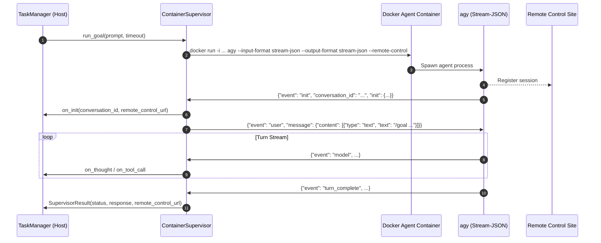

# Autonomous Issue Triage & Review-Fix Cycle Architecture

This document defines the state machine and event-driven architecture for Graviton: automated GitHub Issue triage, PR drafting, PR code review, remediation, re-testing, and approval loops powered by Antigravity agents.

---

## 1. Complete Workflow Loop (Issues + PRs)

---

## 2. Supporting Human Interaction & Issue Triage

### How Graviton Distinguishes Human vs. Agent Comments
Even with a single GitHub account, Graviton differentiates human comments from automated agent comments using **HTML signature tags**:

- **Agent Comments**: All comments written by `issue_triager`, `pr_drafter`, `code_reviewer`, or `code_fixer` include `<!-- antigravity-auto-reply -->`.
- **Human Comments**: Any comment **without** `<!-- antigravity-auto-reply -->` is recognized as coming from a human.

### Supported Interaction Modes

#### Mode 1: Automated Issue Triage & Design Specification
- **Event**: `issues` (`opened`, `edited`) or `issue_comment` (on a pure Issue without a PR).
- **Behavior**: `issue_triager` interacts with issue authors until all requirements, reproduction steps, and design details are gathered.
- **Action**: Once satisfied, `issue_triager` posts a final design spec comment and labels the issue `ready-for-pr` via `gh issue edit --add-label ready-for-pr`.

#### Mode 2: Automated PR Drafting from Labeled Issues
- **Event**: `issues` (`action: labeled` with `label: ready-for-pr`) or `issue_comment` containing `/draft-pr`.
- **Behavior**: `pr_drafter` creates a new feature branch from `main`, implements the feature, executes unit tests, and opens a new PR (`gh pr create`), transitioning the issue into the PR review cycle.

#### Mode 3: Automatic Response to Human Review Comments
- **Event**: `pull_request_review_comment` (inline review comments) or `pull_request_review` (submitted review).
- **Action**: Triggers `code_fixer` to apply line-by-line fixes, run local tests, and push updates back to the PR branch.

---

## 3. Webhook Event Routing Table

| GitHub Event | Sender / Condition | Triggered Agent | Agent Action |
| --- | --- | --- | --- |
| `issues` (`opened`, `edited`) | New issue / issue update | `issue_triager` | Analyzes requirements; posts clarifying questions or applies label `ready-for-pr`. |
| `issues` (`labeled == ready-for-pr`) | Issue ready for code | `pr_drafter` | Implements feature on a new branch, runs tests, and opens initial PR (`gh pr create`). |
| `issue_comment` (on Issue) | Human comment on Issue | `issue_triager` / `pr_drafter` | Continues triage (`issue_triager`) or drafts PR if issue is labeled `ready-for-pr`. |
| `pull_request` (`opened`, `synchronize`) | Git Push / PR creation | `code_reviewer` | Performs full code review, runs static analysis, submits GitHub Review (`APPROVE` or `CHANGES_REQUESTED`). |
| `pull_request_review` | `state == CHANGES_REQUESTED` | `code_fixer` | Parses requested changes, modifies code in `/workspace`, runs tests, commits & pushes. |
| `pull_request_review_comment` | Line comment (no bot tag) | `code_fixer` | Resolves specific inline code comment, pushes commit, and posts thread reply. |
| `issue_comment` (on PR) | Human comment on PR created by us | `code_fixer` | Executes requested task from comment text, pushes commit, and replies to thread (or `code_reviewer` if `/review`). |
| `pull_request_review` | `state == APPROVED` | *None* | Halts workflow; PR ready for merge. |

---

## 4. Safety Guardrails

1. **Max Iteration Limit (Circuit Breaker)**:
   - Each review cycle increments `<!-- agy-cycle: X/3 -->`.
   - Halts after 3 consecutive failed cycles to prevent infinite loops.
2. **Local Test Gate**:
   - `code_fixer` executes unit tests (`pytest` / `npm test` / `flutter test`) locally before committing. If tests fail, it posts the failure log to the PR thread instead of pushing broken code.
3. **Bot Tag Filtering & PR Scope Scoping**:
   - Prevents agent self-triggering by dropping any webhook payload containing `<!-- antigravity-auto-reply -->`.
   - Only processes PR review and comment events for PRs created by Graviton/Antigravity to prevent taking over external PRs.

---

## 5. Periodic Task Scheduler & Codebase Auditor

Graviton includes a zero-dependency periodic background task scheduler engine (`lib/scheduler.py`) that runs alongside the HTTP server process by default.

### Periodic Maintenance Architecture

### Scheduled Job Definitions (`config/schedules.json`)

1. **`periodic_bug_sweep`**:
   - **Target Agent**: `codebase_auditor`
   - **Frequency**: Every 24 hours (86,400s) by default (Enabled: `true`).
   - **Action**: Queries open GitHub issues, scans `/workspace` for unhandled exceptions, resource leaks, broken paths, or race conditions, deduplicates findings, and files new issues via `gh issue create --label "bug"`.
2. **`periodic_quality_sweep`**:
   - **Target Agent**: `codebase_auditor`
   - **Frequency**: Every 24 hours (86,400s) by default (Enabled: `true`).
   - **Action**: Queries open refactoring/enhancement issues, scans codebase for performance bottlenecks, long functions, or modularization needs, deduplicates findings, and files new issues via `gh issue create --label "enhancement"`.
3. **`periodic_security_sweep`**:
   - **Target Agent**: `codebase_auditor`
   - **Frequency**: Every 24 hours (86,400s) by default (Enabled: `false`).
   - **Action**: Scans the codebase for security vulnerabilities, hardcoded secrets, injection vectors, or vulnerable dependencies, deduplicates findings, and files new issues via `gh issue create --label "bug"`.
4. **`periodic_test_coverage_sweep`**:
   - **Target Agent**: `codebase_auditor`
   - **Frequency**: Every 24 hours (86,400s) by default (Enabled: `false`).
   - **Action**: Analyzes test coverage and test quality across modules, identifying coverage gaps, flaky tests (race conditions, sleep-based waits, order dependencies, unmocked state), and low-quality test patterns (vacuous assertions, swallowed exceptions, over-mocking), filing new issues with root-cause analysis and suggested resolutions via `gh issue create --label "enhancement"`.
5. **`periodic_typing_sweep`**:
   - **Target Agent**: `codebase_auditor`
   - **Frequency**: Every 24 hours (86,400s) by default (Enabled: `false`).
   - **Action**: Inspects codebase for missing or loose type annotations, `Any` overuse, and signature mismatches, filing new issues via `gh issue create --label "enhancement"`.
6. **`periodic_dead_code_sweep`**:
   - **Target Agent**: `codebase_auditor`
   - **Frequency**: Every 7 days (604,800s) by default (Enabled: `false`).
   - **Action**: Identifies unreachable branches, unreferenced private helpers, obsolete configuration flags, or unused exports, filing new issues via `gh issue create --label "enhancement"`.
7. **`periodic_docs_audit`**:
   - **Target Agent**: `codebase_auditor`
   - **Frequency**: Every 7 days (604,800s) by default (Enabled: `false`).
   - **Action**: Inspects documentation (`README.md`, `docs/ARCHITECTURE.md`, CLI options, docstrings) for drift against actual implementation, filing new issues via `gh issue create --label "documentation"`.
8. **`periodic_ready_pr_sweep`**:
   - **Target Agent**: `pr_drafter`
   - **Frequency**: Every 4 hours (14,400s) by default (Enabled: `false`).
   - **Action**: Periodically queries open issues labeled `ready-for-pr` without open PRs, initiating `pr_drafter` to create a feature branch, run local tests, and draft a pull request.
9. **`periodic_pr_hygiene_sweep`**:
   - **Target Agent**: `code_reviewer`
   - **Frequency**: Every 12 hours (43,200s) by default (Enabled: `false`).
   - **Action**: Scans open automated pull requests for merge conflicts or failing presubmit CI checks, alerting or queuing remediation.

---

## 6. ContainerSupervisor & Antigravity Stream-JSON Architecture

Rather than spawning one-shot CLI commands with fragile output scraping (`agy --prompt`), Graviton communicates with `agy` over a bidirectional NDJSON stream (`--input-format stream-json --output-format stream-json`):

### Core Advantages:
1. **Multi-Turn Goal Resilience**: Solves timeout and step-limit constraints by keeping the session alive and streaming until the goal is fully satisfied.
2. **Real-time Observability**: Streams thoughts, model decisions, and tool calls directly to server logs and the TUI dashboard as they occur.
3. **Container Isolation**: Mounts an isolated ephemeral clone of the repository into `/workspace` with host user UID/GID mapping and read-only auth volume mounts.
4. **Watchdog Timers**: Enforces both per-turn idle timeouts and maximum task wall-clock timeouts, gracefully terminating hanging containers.

---

## 7. Antigravity Remote Control & Live Session Tracking

Every agent execution is registered with the **Antigravity Remote Control site**:
- **URL Format**: `https://antigravity.google.com/c/<conversation_id>?instance=<instance_name>`
- **Capture Mechanism**: Extracted from NDJSON handshake `init` events, stderr stream banners, or canonical fallback synthesis.
- **Surfacing**:
  - **GitHub Comments**: Initial start comments (🚀) and completion comments include clickable markdown links for immediate browser inspection.
  - **REST API**: The `/health` endpoint exposes `active_remote_control_urls` for active tasks.
  - **MCP Tools**: `graviton_status`, `graviton_list_tasks`, and `graviton_get_task` display live URLs.
  - **TUI Dashboard**: Pressing `o` on the main dashboard or task logs screen instantly opens the session in the user's web browser.

---

## 8. Antigravity Plugin & Model Context Protocol (MCP) Integration

Graviton is packaged as an Antigravity Plugin located at `.agents/plugins/graviton/`:
- **`plugin.json`**: Plugin manifest describing capabilities, hooks, rules, and sidecars.
- **`rules/AGENTS.md`**: Autonomous supervision guidelines instructing Antigravity assistants how to inspect Graviton via MCP tools.
- **`sidecars/`**: Background daemon configuration allowing Antigravity to launch and healthcheck `graviton-server.py` automatically.
- **`mcp/`**: JSON-RPC Model Context Protocol server exposing:
  - `graviton_status`: Health and quota pacing metrics.
  - `graviton_list_tasks`: Active, queued, and completed tasks.
  - `graviton_get_task`: Streaming thoughts, tool executions, and logs.
  - `graviton_submit_review`: Autonomous containerized PR review.
  - `graviton_submit_task`: Custom prompt execution in sandboxed agent.
  - `graviton_abort_task`: Active or queued task cancellation.

---

## 9. Legacy Deprecation

The legacy bash container runner (`bin/run_agent_container.sh`) and one-shot transcript file scraper in `lib/runner.py` are deprecated in favor of `ContainerSupervisor` (`lib/supervisor.py`). They are maintained solely for backward compatibility with older test harnesses and CLI environments.
