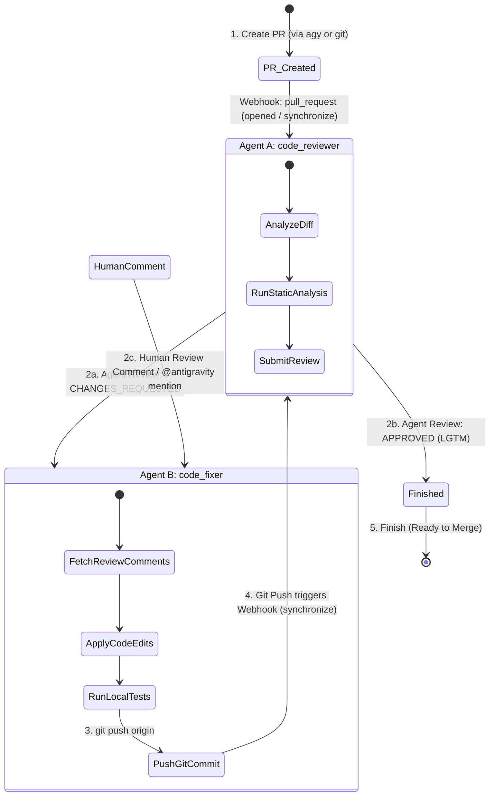

# Automated Review-Fix Cycle Architecture

This document defines the state machine and event-driven architecture for Graviton: fully automated PR review, remediation, re-testing, and approval loops powered by Antigravity agents, with full support for human review comments.

---

## 1. Complete Workflow Loop (Agents + Human Comments)

---

## 2. Supporting Human Review Comments

### How Graviton Distinguishes Human vs. Agent Comments
Even with a single GitHub account, Graviton differentiates human comments from automated agent comments using **HTML signature tags**:

- **Agent Comments**: All comments written by `code_reviewer` or `code_fixer` include `<!-- antigravity-auto-reply -->`.
- **Human Comments**: Any comment **without** `<!-- antigravity-auto-reply -->` is recognized as coming from a human.

### Supported Human Interaction Modes

#### Mode 1: Automatic Response to Human Review Comments
- **Event**: `pull_request_review_comment` (inline line-by-line review comments) or `pull_request_review` (submitted human review).
- **Behavior**: When you leave a review comment on a PR line (e.g., *"Please handle null safety here"*), Graviton detects a human comment without the bot signature tag.
- **Action**: Triggers `code_fixer` with a prompt containing:
  - Comment body & file path
  - Line number & diff context
- `code_fixer` applies the change, runs local tests, pushes the commit, and replies to your comment thread:
  > *"I've applied your suggested change on line 42 in commit `c3d4e5f`. Tests passed!"*

#### Mode 2: Explicit Mention Commands (`@antigravity` or `/fix`)
- **Event**: `issue_comment` (general PR discussion comment).
- **Behavior**: You comment on the PR: `@antigravity add unit tests for daily capacity limits`.
- **Action**: Graviton detects `@antigravity` or `/fix`, extracts your prompt, and launches `code_fixer` to implement the requested feature/fix.

---

## 3. Webhook Event Routing Table

| GitHub Event | Sender / Condition | Triggered Agent | Agent Action |
| --- | --- | --- | --- |
| `pull_request` (`opened`, `synchronize`) | Git Push / PR creation | `code_reviewer` | Performs full code review, runs static analysis, submits GitHub Review (`APPROVE` or `CHANGES_REQUESTED`). |
| `pull_request_review` | `state == CHANGES_REQUESTED` (No bot tag) | `code_fixer` | Parses requested changes, modifies code in `/workspace`, runs tests, commits & pushes. |
| `pull_request_review_comment` | No bot tag (`<!-- antigravity-auto-reply -->`) | `code_fixer` | Resolves specific inline code comment, pushes commit, and posts thread reply. |
| `issue_comment` | Body contains `@antigravity` or `/fix` | `code_fixer` | Executes requested task from comment text, pushes commit, and replies to thread. |
| `pull_request_review` | `state == APPROVED` | *None* | Halts workflow; PR ready for merge. |

---

## 4. Safety Guardrails

1. **Max Iteration Limit (Circuit Breaker)**:
   - Each review cycle increments `<!-- agy-cycle: X/3 -->`.
   - Halts after 3 consecutive failed cycles to prevent infinite loops.
2. **Local Test Gate**:
   - `code_fixer` executes unit tests (`flutter test` / `npm test`) locally before committing. If tests fail, it posts the failure log to the PR thread instead of pushing broken code.
3. **Bot Tag Filtering**:
   - Prevents agent self-triggering by dropping any webhook payload containing `<!-- antigravity-auto-reply -->`.
